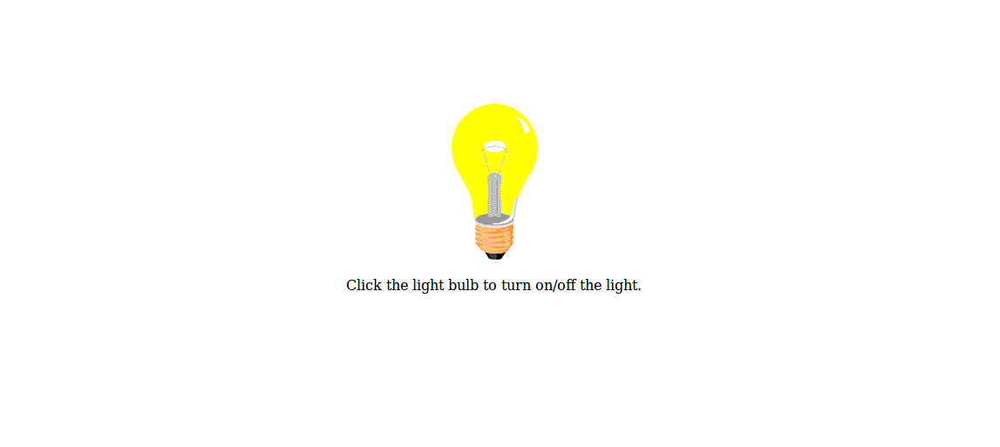

# Simple Ligth Bulb

This ligth Bulb is special because is connected with a serverless api. Take a look the code of the [serverless api here](https://github.com/xergioalex/serverless-ligth-bulb) 😎.

Also check a [basic iot client http using NODEMCU and esp2866 wifi](https://github.com/xergioalex/iot-basic-http-client) module to get and control data for LED light.

